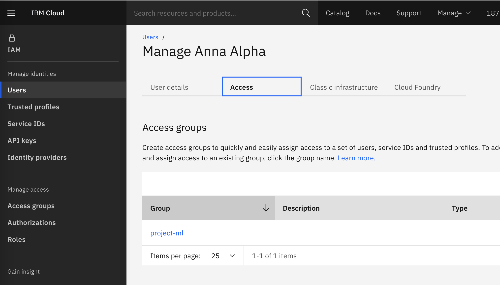

---

copyright:
  years: 2021, 2022
lastupdated: "2022-07-26"

keywords: quantum, Qiskit, runtime, near time compute, university, business, organization

subcollection: quantum-computing

content-type: tutorial
completion-time: 25m
---

{{site.data.keyword.attribute-definition-list}}

# Use Cloud as the ID provider
{: #cloud-provider-org}
{: toc-content-type="tutorial"}
{: toc-completion-time="25m"}

Intro
{: shortdesc}

## Using Cloud Users: Invite Users
{: #invite-cloud-org}
{: step}

When users use their own IBM Cloud accounts to access project resources, users can be invited.
Go to [Manage -- Access (IAM)](https://cloud.ibm.com/iam/overview){: external} and click on [Invite users](https://cloud.ibm.com/iam/users/invite_users){: external}.
Enter the email addresses of users to be added.
Select the access group or groups of the projects that the additional users should be part of.
This assignment can be changed or extended later on.

## Managing Access through the Cloud Administrator: Modify Users' Assignments to Projects
{: #cloud-assign-user-org}
{: step}

If ID provider users are used as identities, note that IBM Cloud knows about ID provider users only after the first login.
At that point, users will not have any permissions.
Accordingly, access can only be given or modified after the IDP user has logged in for the first time.

This step applies to Cloud users that have been invited as well as ID provider users which have been added to the account and are managed through the Cloud administrator.
You can mix both kinds of users and use the steps in this section.

To change access of users and add them to projects, refer to the Changing Access of Users section.

Go to [Manage -- Access (IAM) -- Users](https://cloud.ibm.com/iam/users){: external} and click on the user.

{: caption="Figure 11. Change User Access" caption-side="bottom"}

Add additional access groups with Assign group, or remove the user from the access group with the three dots on the right hand side (Remove user)

## User Flow
{: #user-org}
{: step}

Users having an IBM Cloud account can login through the [IBM Cloud portal](https://cloud.ibm.com/){: external}.

To work with Qiskit Runtime, users can create an API key ([Manage -- Access (IAM) -- API keys](https://cloud.ibm.com/iam/apikeys){: external}) and use it for service instances they have got access to.
