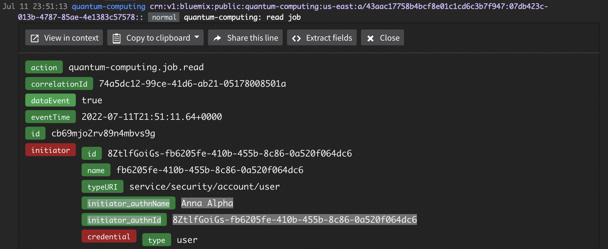

---

copyright:
  years: 2021, 2022
lastupdated: "2022-07-25"

keywords: quantum, Qiskit, runtime, near time compute, university, business, organization

subcollection: quantum-computing

content-type: howto
---

{{site.data.keyword.attribute-definition-list}}

# Set up Qiskit Runtime for an organization
{: #quickstart-org}
{: toc-completion-time="25m"}

When working in an organization where individuals might work on several projects, the governance of consuming Qiskit Runtime can seem complex. However, access management can be used to easily enable collaboration by users who work on the same project, as well as to restrict visibility of users and projects that should be isolated from each other. Managing access becomes particularly relevant when sharing Qiskit Runtime resources that are not free; that is, Qiskit Runtime service instances that use the Standard plan.
{: shortdesc}

## Overview
{: #overview-org}

IBM Cloud provides various ways to implement these mechanisms described in this tutorial.  There might be several ways to achieve these objectives. Additionally, most of the steps in this tutorial are generic to IBM Cloud and not specific to Qiskit Runtime, except the custom role details.
{: note}

### Involved Personas
{: #personas-org}

The are several main personas used in this tutorial:

* **User**: Someone who gets access to Qiskit Runtime resources (_service instances_) and can potentially collaborate with other users on these resources. Users' access is controlled by an administrator and they cannot create or delete service instances.
* **Cloud administrator**: An IBM Cloud account owner who owns Qiskit Runtime resources and manages which users can access these resources. As resource owner, the administrator is charged for any paid resource use.
* **IDP administrator**: An administrator who defines identities and their attributes in an identity provider (IDP).

### Terminology
{: #terms-org}

This tutorial uses the following terms in this tutorial:

* *Resource*: A generic Cloud term that refers to an object that can be managed through the Cloud user interface, CLI, or API. For this tutorial, a _resource_ is a service instance of Qiskit Runtime.
* *Service instance*: A service instance is used to access Cloud functionality, specifically, quantum computing on real devices or simulators. It is defined through the catalog. You can define several service instances based on the same or different plans, which can offer access to different quantum computing backends See the [Qiskit Runtime documentation](https://cloud.ibm.com/docs/quantum-computing?topic=quantum-computing-quickstart){: external} for more details.
* *Project*: A grouping unit that enables users to work on the same resources. In that case, users are seen as part of the same project. This tutorial uses two projects; `ml` and `finance`. See [Nested project structures](#nest-org) for more information.

   This project is not related to the "project" concept in IBM Quantum Platform.
   {: note}

## Plan your setup
{: #planning-org}
{: step}

Before setting up Qiskit Runtime for your organization, you need to decide the following:

* How will user identities be defined? You can set up IBM Cloud users, users from another IDP, or both.
  * If you are using a different IDP, will the Cloud administrator or the IDP administrator assign  users to project resources?
    * If the IDP administrator performs this assignment, you will need a string to be used as a key, such as `project` (which this tutorial uses) for project comparisons.
* What are the projects and which service instances should belong to each? Each project needs a name.
  * Project names should not be substrings of another.  For example, don't use `ml` and `chemlab` because a string match for `ml` will succeed for both strings. Instead use `ml` and `chem-lab`.
  * Note that quantum experiments (jobs) belong to service instances, and users having access to an instance can see its jobs. Also, service instances can be based on different plans, allowing access to different backends like real devices or simulators. See the [Qiskit Runtime documentation for more details](https://cloud.ibm.com/docs/quantum-computing?topic=quantum-computing-choose-backend){: external}
* Which users should get visibility to which projects?
* Should users be able to delete jobs? Keeping jobs in service instances gives more traceability to how billing cost was induced.  Therefore, it is common practice to not allow users to delete jobs.
* Will you use access groups that directly reference Qiskit Runtime service instances or organize services into resource groups?
   * **Access groups** are the most common way of controlling user access for IBM Cloud resources.  They are a simple but powerful means to consistently assign user access. We create a access group for each project and map users to access groups. Each access group uses a custom role that allows users to access specific  Qiskit Runtime service instances or resource groups.
   * **Resource groups** are used only when you need to maintain a clear separation of service instances.  If additional service instances are created in a resource group, all users having access to the resource group will see them automatically without updating access groups.  If you choose to use resource groups, you will still create access groups, which will then be assigned to resource groups.

   A service instance can only belong to one resource group and after instances are assigned into resource groups, they cannot be changed. This also means that the resource group assignment can only happen at service instance creation. Therefore, resource groups may not provide enough flexibility if assignments of service instances to resource groups might need to change.
   {: note}

## Configure IAM settings
{: #iam-org}
{: step}

First, there are some settings to configure in the administrator's Identity and Access Management (IAM)  account. To review and configure these settings, go to [Manage → IAM → Settings](https://cloud.ibm.com/iam/settings){: external}.

* **User list visibility** determines whether users can see each other, regardless of project assignment. the `enabled` setting restricts user visibility.  That is, users in your account cannot see each other, even if they  can access the same resources. Choose the appropriate value for your environment. See [Controlling user visibility](https://cloud.ibm.com/docs/account?topic=account-iam-user-setting){: external} for more information.
* **API key creation** controls whether users can create API keys.  For this tutorial, users need API keys. Therefore, this setting should be `disabled`.  Alternatively, you can give specific permissions to each user.

{: caption="Figure 1. IAM settings page with User list visibility enabled" caption-side="bottom"}

## (Optional) Create resource groups
{: #crt-rsc-grp-org}
{: step}

Skip this step if you are using access groups that directly reference Qiskit Runtime service instances.

If you chose to use resource groups, go to [Manage → Account → Resource groups (in Account resources)](https://cloud.ibm.com/account/resource-groups){: external} and click **Create**.

## Create Qiskit Runtime service instances
{: #create-instance-org}
{: step}

If you have already created Qiskit Runtime service instances, skip this step.

* If you are using resource groups, make sure to create the service instances on the appropriate resource group.
* If you are using access groups, the service instance name, such as `QR-ml`, is needed for access group references.

See [Create a service instance](/docs/quantum-computing?topic=topic=quickstart#create-configure) for instructions.

## Create access groups for projects
{: #create-group-org}
{: step}

First, we create a custom role that allows users to perform actions to work with Qiskit Runtime service instances for each access group.  Next, we create an access group for each project and give that group the minimum set of permissions required to work with the project resources. In a later step, We map users to access groups.

Follow these steps to set up an access group:

1. Create a custom role.
   1. In [Manage → IAM → Roles](https://cloud.ibm.com/iam/roles){: external}, click  `Create`.
   2. Enter a name, ID, description, and select `Qiskit Runtime` from the service as shown in the image:
      {: caption="Figure 4. Creating a custom role" caption-side="bottom"}
   3. Select the following roles, then click **Create**.
      * quantum-computing.device.read
      * quantum-computing.job.cancel
      * quantum-computing.job.create
      * quantum-computing.job.read
      * quantum-computing.program.create
      * quantum-computing.program.delete
      * quantum-computing.program.read
      * quantum-computing.program.update
      * quantum-computing.user.logout
      * Only select quantum-computing.job.delete if you want users to delete jobs.

      {: caption="Figure 5. Define actions for the custom role" caption-side="bottom"}

      You can optionally define more fine grained roles by following [these instructions](#more-roles-org).
      {: note}

2. Create an access group.
   1. Navigate to [Manage → IAM → Access groups](https://cloud.ibm.com/iam/groups){: external} and click **Create**.
   2. Enter a name, like `project-ml`, and a description.
3. Assign access to the group.
   1. Select the Access tab and click **Assign access**.
   2. In the Service list, search for **Qiskit Runtime** and select it, then click **Next**.
      {: caption="Figure 6. Select Service for Access Group" caption-side="bottom"}

   3. In Resources, select **Specific resources**. For Attribute type, choose **Service Instance**.
   4. From the drop down list, select the service instance you want to add to the access group, for example, `QR-ml`. If you are using resource groups, select the resource group instead of selecting individual service instances.  Click **Next**.
      {: caption="Figure 7. Select Resources for Access Group" caption-side="bottom"}

   5. For Roles and actions, select **Viewer** and the custom role created previously.  Click **Add**, then **Assign**.
      {: caption="Figure 8. Select Roles and actions for Access Group" caption-side="bottom"}

   6. Repeat this step if you want to give an access group permissions to several service instances.

## Set up your ID provider and assign users
{: #setup-idp-org}
{: step}

Follow the steps in the appropriate topic, depending on the ID provider you chose to use:

- [Use an ID provider other than IBM Cloud](/docs/quantum-computing?topic=appid-org)
- [Use Cloud as the ID provider](/docs/quantum-computing?topic=cloud-provider-org)

## Example scenario
{: #steps-org}

In our example, we want to create the following setup:
* We have two projects, `ml` and `finance`.
  * The `ml` project should have access to the service instances `QR-ml` and `QR-common`.
  * The finance project should have access to the service instances `QR-finance` and `QR-common`.
* We have three users.
  * Fatima should have access to the ml project.
  * Ravi should have access to the finance project.
  * Amyra should have access to both projects.
* We will use access groups without resource groups.
* Users are defined in an App ID instance and project assignments are also done there.
* Users should be able to delete jobs.

The steps to implement this setup are:
1. The Cloud administrator creates an App ID instance and ensures that it is linked in the Cloud administrator's account. The ID provider URL will be passed on to users.
2. The Cloud administrator creates service instances `QR-ml`, `QR finance` and `QR-common`.
3. The Cloud administrator creates a custom rule including the `quantum-computing.job.delete` action.
4. The Cloud administrator creates access groups.
  * The `ml` access group can access `QR-ml` and `QR-common`. This access group should get a dynamic rule for the App ID IDP that accepts users whose `project` attribute contains `ml`.
  * The `finance` access group can access `QR-finance` and `QR-common`. This access group should get a dynamic rule for the App ID IDP that accepts users whose `project` attribute contains `finance`.
5. The IDP administrator uses the App ID instance that the Cloud administrator created and defines the three users:
  * For Fatima, the custom attributes should contain `{"project":"ml"}`.
  * For Ravi, the custom attributes should contain `{"project":"finance"}`.
  * For Amyra, the custom attributes should contain `{"project":"ml finance"}`.
6. Users can log in through the ID provider URL, create API keys, and work with their projects' service instances.

## Additional Considerations
{: #considerations-org}

You should understand the following considerations when setting up your environment.

### Auditability
{: #audits-org}

Activity tracker logs significant actions performed on Qiskit Runtime service instances.  Create an instance of Activity Tracker in the region of your Qiskit Runtime instances to get an audit trail of events.
Refer to the Qiskit Runtime [Activity Tracker page](https://cloud.ibm.com/docs/quantum-computing?topic=quantum-computing-at_events){: external} for details about the events logged.

This audit log contains the fields `initiator_authnName` and `initiator_authnId`, which match the name shown in [Manage → Access (IAM) → Users](https://cloud.ibm.com/iam/users){: external}.  To view this field, click on the user name, then **Details** in the **IAM ID** field.

{: caption="Figure 12. Example of an Activity Tracker event" caption-side="bottom"}

To capture App ID events, open your App ID instance, open **Manage Authentication -> Authentication settings** and enable **Runtime Activity**.

### Defining more fine grained roles
{: #more-roles-org}

The actions in the custom roles can be used for more fine grained access control.
For example, some users might need full access to work on service instances while others might only need read access to service instances, programs, and jobs.

To achieve that, define two different custom roles: remove all cancel, delete, and update roles from the reader custom role, and include all actions in the custom role for the writer. Next, add the roles to two different access groups accordingly.

When using dynamic rules, that is, when the IDP administrator manages access through custom IDP user attributes, do not use IDP custom user attributes that are substrings of each other.  For instance, don't use `ml` and `ml-reader`, as the string comparison of `ml` would also accept `ml-reader`. Use `ml-reader` and `ml-writer` to avoid this conflict.

### Other Cloud resources
{: #other-cloud-rsc-org}

The steps used in this tutorial can be used to manage access to other Cloud resources as well.
Include the appropriate permissions to the access groups of the relevant projects.

### Nested project structures
{: #nest-org}

In this tutorial, the mapping of users to projects and service instances was kept simple. However, by associating several users with access groups and referencing service instances from several access groups, any arbitrary mapping can be implemented.

This method can accommodate a hierarchical structure, that is, it can align to how users might be assigned to the Hub/Group/Project access structure in the IBM Quantum Platform.  For example, a _group_ could be an access group that is assigned to all service instances of the group's projects. Users who should get access to all of the group's projects would then only have to be added to the group's access group.

### Consistent and repeatable deployment of the configuration
{: #repeat-org}

The steps of this tutorial can be automated for consistent and repeatable management of users, projects, and the mapping between those. Refer to the [Terraform IBM Cloud Provider documentation](https://registry.terraform.io/providers/IBM-Cloud/ibm/latest/docs){: external} for templates.
