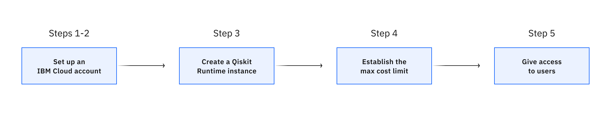

---

copyright:
  years: 2023
lastupdated: "2023-09-26"

keywords: quantum, Qiskit, runtime, pay-go, standard plan, upgrade
content-type: tutorial
subcollection: quantum-computing
completion-time: 30m

---

{{site.data.keyword.attribute-definition-list}}

# Upgrade from the Open plan
{: #upgrade-from-open}
{: toc-content-type="tutorial"}
{: toc-completion-time="30m"}

This tutorial is for entities coming from IBM Quantum Open plan and want to upgrade to an IBM Cloud Standard (Pay-As-You-Go) plan. To get a similar user experience in both plans, follow these steps.
{: shortdesc}

{: caption="Figure 1. Steps to upgrade from the Open plan" caption-side="bottom"}

## Differences between the Open and Standard plans
{: #diff-open-standard}

There are a few functional differences between IBM Quantum and the IBM Cloud Qiskit Runtime service that you should take into account. The biggest difference is that IBM Cloud only supports the Qiskit IBM Runtime client. Therefore, if you are still using Qiskit IBM Provider, review the [Migrate to using Qiskit Runtime primitives](https://docs.quantum-computing.ibm.com/start/migrate){: external} and [backend.run compared to Qiskit Runtime](https://docs.quantum-computing.ibm.com/start/compare#backendrun-compared-to-qiskit-runtime){: external} topics for instructions to update your code.

## Sign up for IBM Cloud
{: #sign-up-cloud}
{: step}

Skip this step if you already have an IBM Cloud account. Follow these steps to sign up for IBM Cloud:

1. Go to the [IBM Cloud registration page](https://cloud.ibm.com/registration){: external}. Fill in the form and accept the terms.
2. Verify your identity by providing the additional account information as required.

Next, [create a Qiskit Runtime instance](#create-qr-account). 

## Upgrade your IBM Cloud account
{: #update-cloud-account}
{: step}

Skip this step if you already have an IBM Cloud account with a Pay-As-You-Go plan. All new IBM Cloud accounts are set up with a Pay-As-You-Go plan. 

You must upgrade your IBM Cloud account in the following circumstances:

- You have a Trial account.
- You have a Lite account that you created before 25 October 2021.

After you upgrade, you can continue to use any instances that you created with your Lite account.

To upgrade to a Pay-As-You-Go account, complete the following steps:

1. Go to Manage > [Account](https://cloud.ibm.com/account){: external} in the IBM Cloud console.
2. Select **Account settings**, and click **Add credit card**.
3. Enter your payment information and click **Next** to submit your information.
4. After your payment information is processed, your account is upgraded, and you can explore and access the full IBM Cloud catalog. For any billable services that you use beyond any free allowances, you receive a monthly invoice. For full details, see [Upgrading your account](https://cloud.ibm.com/docs/account?topic=account-upgrading-account){: external}.

## Create a Qiskit Runtime instance
{: #create-qr-account}
{: step}

To create a Qiskit Runtime service instance, complete the following steps:

1. Go to [Quantum instances](https://cloud.ibm.com/quantum/instances){: external} and click [Create instance](https://cloud.ibm.com/catalog/services/quantum-computing){: external} at the top right.
1. Complete the following on the creation page:
   - Select **Standard plan** and change the default name of the instance to the one you will use.
   - If you have a promotional code, enter it in **Apply promo code** in the right panel and click **Apply**.
   - Accept the terms and click **Create**. You will be redirected to the new instance details page.

## Set the maximum cost limit
{: #set-max-cost-new}
{: step}

If you successfully created a Qiskit Runtime instance in the previous step, you were redirected to the instance details page. Otherwise, open it by going to the [Instances page](https://cloud.ibm.com/quantum/instances){: external}, and the click on the instance you created.

To set the maximum cost limit, complete the following steps:

1. Click **Edit** in the Cost limits panel.
1. In the field **Maximum total cost limit**, enter the maximum cost allowed in this instance, then click **Save**.

If the instance usage reaches this limit, any running jobs are cancelled and the instance will not incur additional charges. [More info](/docs/quantum-computing?topic=quantum-computing-cost).

## Manage users and access
{: #manage-users-access}
{: step}

Skip this step if you are an individual user setting this up for your own use. We are going to assume that the owner of this account will also be the administrator of the Qiskit Runtime instances that the rest of the company's users will use. In more complex configurations, there could be more roles and many different ways to manage the company, as explained in [Plan Qiskit Runtime for an organization](/docs/quantum-computing?topic=quantum-computing-quickstart-org). 

As the account owner or administrator, you add the people in your organization to the IBM Cloud account and then assign them access permissions to use the Qiskit Runtime instance created in [step 3](#create-qr-account).

To share a Qiskit Runtime instance with other users, complete the following steps:

1. Go to Manage > [Access (IAM)](https://cloud.ibm.com/iam/overview){: external} in the IBM Cloud console.
1. On the left panel in the **Manage access** section, click **Access groups**, then click **Create** on the right side. 
1. In the **Create access group** window that opens, add a name and description that represent the group of users that you will invite.  For example, the company name. Click **Create**.
1. In the access group just created, click the **Access** tab, then click **Assign access** at the top right. 
1. In the **Create policy** page that opens, define these elements: 
   - **Service** - Select the service you will give access to. In the search field look for Qiskit Runtime and select it. Click **Next**.
   - **Resources** - Select **Specific resources**, and in the rest of the dropdowns:
      - For **Attribute type**, select **Service Instance**.
      - For **Operator**, select **string equals**.
      - For **Value**, select the instance you created. Click **Next**.
   - **Roles and actions** - Select the following values:
      - For **Service access**, select **Reader**.
      - For **Platform access**, select **Viewer**.
      - For **Custom access**, select **User actions for Qiskit Runtime**. Click **Next**.
   - **Conditions (optional)**. Click **Review**.
   At the bottom, click **Add**. You should see the policy on the right panel. Click **Assign** at the bottom of the right panel. You have successfully created an access group.
1. On the left panel in the **Manage identies** section, click **Users**. Then, at the top right click **Invite users**.
   - Enter the email addresses of your users separated by commas, spaces, or line breaks.
   - Select **Access groups** as the way to assign access.
   - In the access groups table, select the one you already created andc click **Add**. You will see the Access summary on the right panel. Click **Invite** at the bottom of the Access summary panel.

Users will receive an email with an invitation to use this account with the access defined in the [step 3](#create-qr-account) for the shared instance. After they accept the invitation, they will see a new account in their account switcher at the top of any page on IBM Cloud. After selecting it, they will see the shared instance.
