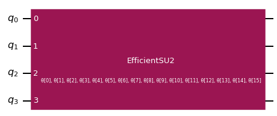

---

copyright:
  years: 2021
lastupdated: "2021-11-05"

keywords: quantum, Qiskit, runtime, near time compute, quantum program, vqe

subcollection: quantum-computing

content-type: tutorial
account-plan: lite
completion-time: 10m

---

{{site.data.keyword.attribute-definition-list}}

# Example: Run a job and view results with VQE
{: #vqe-example}
{: toc-content-type="tutorial"}
{: toc-completion-time="20m"}

In this example, we walk through all steps necessary to run the Variational Quantum Eigensolver (VQE) sample program.  The steps to run other sample programs are similar.  VQE is a central algorithm in many applications such as quantum chemistry or optimization. This tutorial shows you how to run the VQE as a Qiskit Runtime program. We first prepare the input parameters, such as the Hamiltonian and ansatz, and then test VQE locally, upload it to {{site.data.keyword.quantum_long_notm}}, then run it remotely.
{: shortdesc}

## Before you begin
{: #before-vqe}

Perform the following before you begin:

- Familiarize yourself with the VQE program.  
- Install Qiskit: `pip install qiskit`. For more detailed instructions, refer to the [Qiskit textbook.](https://qiskit.org/textbook/ch-appendix/qiskit.html){: external}.

Unless otherwise stated, this tutorial uses a Python environment.
{: note}

## Obtain credentials
{: #obtain-credentials}
{: step}

For authentication, you need to gather some information and use it to set up an authenticator.

- From the [{{site.data.keyword.cloud_notm}} API keys page](https://cloud.ibm.com/iam/apikeys){: external}, view or create your API key. You might need to use light theme to see your entries. Copy this key. For example:

  ```text
   poJraWQiOiIyMDIxMTAzMDE1MTQiLCJhbGciiuJSUzI1NiJ9.eyJpYW1fdWQiOiJJQk1pZC0xMTAwMDBCS1VWIiwiaWQiOiJJQk1pZC0xMTAwMDBCS1VWIiwicmVhbG1pZCI6IklCTWlkIiwianRpIjoiMjgzMDE3MWItYmY1MC00ZGEyLWE4MjAtMjFmNGVjYWQ0NDE0IiwiaWRlbnRkj
  ```

- Find your Cloud Resource Name (CRN). From the [{{site.data.keyword.cloud_notm}} console](https://cloud.ibm.com){: external}, scroll to Resource summary, click "Services and software", then click the row that contains your quantum service instance (not the name of the instance). In the pane that opens, click the icon to copy your CRN. For example:
  ```text
      crn:v1:staging:public:quantum-computing:global:a/7aca585718d0487bbd174c097e032b27:a2ee9c4f-7a00-4886-ae1c-7f62814a19f9::
  ```
Run the following command.

```python

IAM_API_KEY = '<insert-your-API-key-here>'
CRN = '<insert-your-crn-here>'
QISKIT_RUNTIME_ENDPOINT = 'https://us-east.quantum-computing.cloud.ibm.com'
```

## Prepare parameters
{: #set-params}
{: step}

The following parameters are required for VQE:

- Operator: The Hamiltonian whose smallest eigenvalue we're trying to find. Should be `PauliSumOp`.
- Ansatz: A parameterized quantum circuit preparing the ansatz wavefunction for the VQE. It is assumed that all qubits are initially in the 0 state.
- Optimizer: The classical optimizer that is used to update the parameters in each iteration. This value can be any of Qiskit's Optimizer classes. If you are using a dictionary, only SPSA and QN-SPSA are supported.  Additionally, the dictionary must specify the optimizer name and options.
- Intial Point: Initial parameters of the ansatz. Can be an array or the string `random` to choose random initial parameters.

### System Hamiltonian
{: #system-Hamiltonian}

Begin by defining the operator for which you want to determine the ground state. We chose a simple diagonal Hamiltonian acting with Pauli-Z operators on the first two qubits.

Use Qiskit’s `opflow` module to construct this Hamiltonian:

```python
from qiskit.opflow import Z, I

num_qubits = 4
hamiltonian = (Z ^ Z) ^ (I ^ (num_qubits - 2))
```

This Hamiltonian has a ground state energy -1.

```python
target_energy = -1
```

### Parameterized anzatz circuit
{: #param-anzatz}

Next, choose a parameterized quantum circuit to prepare the `ansatz` wavefunction.

We used the `EfficientSU2` circuit from Qiskit’s circuit library, which is a hardware efficient, heuristic ansatz with alternating rotation and entanglement layers.

```python
from qiskit.circuit.library import EfficientSU2

# the rotation gates are chosen randomly, so we set a seed for reproducibility
ansatz = EfficientSU2(num_qubits, reps=1, entanglement='linear', insert_barriers=True)
ansatz.draw('mpl', style='iqx')
```

#### Output
{: #output-vqe-diagram}

{: caption="Figure 1. ansatz.draw output" caption-side="bottom"}


## Solve with the VQE
{: #solve-with-vqe}
{: step}

Use VQE to solve for the minimal eigenvalue of our Hamiltonian. The VQE requires a classical optimization routine(`optimizer`), along with an `initial point`, to calculate the parameter updates.

```python
import numpy as np
from qiskit.algorithms.optimizers import SPSA

optimizer = SPSA(maxiter=50)

np.random.seed(10)  # seed for reproducibility
initial_point = np.random.random(ansatz.num_parameters)
```

## Test locally
{: #test-locally}
{: step}

Everything is ready to test locally and through the cloud service.  First, test locally using VQE in Qiskit:

```python
from qiskit.providers.basicaer import QasmSimulatorPy  # local simulator
from qiskit.algorithms import VQE


local_vqe = VQE(ansatz=ansatz,
                optimizer=optimizer,
                initial_point=initial_point,
                quantum_instance=QasmSimulatorPy())

local_result = local_vqe.compute_minimum_eigenvalue(hamiltonian)

print('Eigenvalue:', local_result.eigenvalue)
print('Target:', target_energy)
```

### Output
{: #output-vqe-python-eigenvalue}

```python
Eigenvalue: (-0.990234375+0j)
Target: -1
```

## Test with the API on cloud
{: #test-online}
{: step}

To execute the runtime program using the cloud service, you can make API calls within the Python environment. The following information is needed:

- The program ID of the program to use
- The backend to run on
- The input parameters for the program serialized into JSON

### Find the program ID
{: #find-program-id}

The following command prints a list of available programs.  All public programs and any programs you uploaded are listed.  

```python

import requests


response = requests.get(QISKIT_RUNTIME_ENDPOINT+'/programs', headers={'Authorization': 'apikey '+IAM_API_KEY, 'Content-Type': 'application/json', 'Service-CRN': CRN})

json_data = response.json() if response and response.status_code == 200 else None

if json_data and 'programs' in json_data:
    for program in json_data['programs']:
            name = program.get('name')
            print("Name:", name)
            prog_id = program.get('id')
            print("id:", prog_id)
            description = program.get("description")
            print("Description:", description+"\n")
```

#### Output
{:# output-list-of-sample-programs}

```text
Name: sample-program
id: sample-program
Description: A sample runtime program.

Name: vqe
id: vqe
Description: Variational Quantum Eigensolver (VQE) to find the minimal eigenvalue of a Hamiltonian.

Name: circuit-runner
id: circuit-runner
Description: A runtime program that takes one or more circuits, compiles them, executes them, and optionally applies measurement error mitigation.

Name: quantum-kernel-alignment
id: quantum-kernel-alignment
Description: Quantum kernel alignment algorithm that learns, on a given dataset, a quantum kernel maximizing the SVM classification margin.
```

The program ID for vqe is vque, as shown in the previous output.

### Choose a backend
{: #choose-a-backend-section}

To find your available backends, go to your [{{site.data.keyword.quantum_long_notm}} Services page](/quantum/services){: external}. Note the name of the backend you want to use.  We will use `ibmq_qasm_simulator`.

### Serialize the parameters and run the job
{: #serialize-parms-and-run}

JSON is the standard language for passing data to and from cloud services.  Therefore, we must serialize (convert) the parameters that were previously defined and pass them into the `POST /jobs` API. This process is done by using the Qiskit RuntimeEncoder class.


```python
import json
from qiskit.providers.ibmq.runtime import RuntimeEncoder


vqe_inputs = {
    "program_id": "vqe",
    "backend": "ibmq_qasm_simulator",
    "params": {
        "operator": hamiltonian,
        "ansatz": ansatz,
        "optimizer": optimizer,
        "initial_point": initial_point,
        "shots": 1000,
        "measurement_error_mitigation":True
}}

inputs = json.dumps(vqe_inputs, cls=RuntimeEncoder)

resp = requests.post(
    QISKIT_RUNTIME_ENDPOINT+'/jobs',
    headers={'Authorization': 'apikey '+IAM_API_KEY, 'Content-Type': 'application/json', 'Service-CRN': CRN},
    data=inputs)

print(resp.json())
```

#### Output
{: #output-from-running-a-job}

A job ID is generated.  For example: `{"id": "c5t65he4rpq9pv1n4o40"}`

### Review the results
{: #review-the-results-vqe}

Use the job ID to check the results by running the `GET /jobs/{id}/results`  API command:

```python
job_id = resp.json()['id']

json_results = requests.get(
    QISKIT_RUNTIME_ENDPOINT+'/jobs/'+job_id+'/results',
    headers={'Authorization': 'apikey '+IAM_API_KEY, 'Content-Type': 'application/json', 'Service-CRN': CRN})

json_results.json()
```

### Output
{: #another-vqe-output-example}

<details>
  <summary>Click to view the output</summary>

```shell
{'optimizer_evals': None,
 'optimizer_time': 8.136704444885254,
 'optimal_value': -0.9999992908781012,
 'optimal_point': {'__type__': 'ndarray',
  '__value__': 'eJyb7BfqGxDJyFDGUK2eklqcXKRupaBuk2ahrqOgnpZfVFKUmBefX5SSChJ3S8wpTgWKF2ckFqQC+RqGZjqaOgq1CuQDLrdJryxFOf/Zdzz6ZV2w9eP+O6rNN+7EMzrwc97eeMXtiz2L6fYwvjIGh/1nszTOLblvX7Lw9MZS0xf2Me8OdC9n5HRg+NruPJW9e//MkNmH7Nd/239husy6z1r39q9i4Plk58Lh8HXhm66fQd/228w1O3nW8od91iJuQwl+docPb77OOcOttx8ALdxbnA=='},
 'optimal_parameters': None,
 'cost_function_evals': 100,
 'eigenstate': {'0000': 0.4679743252271406,
  '0001': 0.03162270290429101,
  '0010': 0.0447213147924391,
  '0011': 0.24289919501682952,
  '0100': 0.28982755851055336,
  '0101': 0.0447213146360975,
  '0110': 0.04472131503109693,
  '0111': 0.3898717625575001,
  '1000': 0.4806245573961062,
  '1001': 0.0547722248752624,
  '1010': 0.0001898868232508193,
  '1011': 0.2049390487878648,
  '1100': 0.29832869801895895,
  '1101': 0.07071066379196708,
  '1110': 0.04472131512515927,
  '1111': 0.32710855401943917},
 'eigenvalue': {'__type__': 'complex',
  '__value__': [-0.9999992908781012, 0.0]},
 'aux_operator_eigenvalues': None,
 'optimizer_history': {'loss': [0.6619997891688858,
   0.3709997319252579,
   0.11700005370152658,
   0.1360000067305479,
   -0.5719997879652106,
   -0.5559999750641333,
   -0.5679999965477777,
   -0.5900000208172959,
   -0.7909995359757247,
   -0.8629998122876688,
   -0.9869996962097018,
   -0.9880000073510387,
   -0.9869997146503444,
   -0.9919997709030608,
   -0.9899998795396362,
   -0.9909998942687425,
   -0.9899995720554314,
   -0.9869991158482763,
   -0.9880000130696205,
   -0.9860000706633556,
   -0.986000166707226,
   -0.9939999175384961,
   -0.994999882183024,
   -0.9939997301187968,
   -0.9949997996628134,
   -0.9949998018840097,
   -0.9989998349086764,
   -0.9890000665267518,
   -0.9940000450457878,
   -0.9939997226104109,
   -0.9929996360188567,
   -0.9909999804782372,
   -0.9859999903397567,
   -0.9939999728276829,
   -0.9940001233415702,
   -0.9929999950266235,
   -0.9959995234689125,
   -0.998000030887464,
   -0.9919998998465327,
   -0.9970000041250354,
   -0.9979996737066132,
   -0.9880001218361125,
   -0.9880000101075277,
   -0.9909997427672763,
   -0.9969998269642539,
   -0.9919998283605413,
   -0.996999755335499,
   -0.9939994679200048,
   -0.9960000150487271,
   -0.9959999001785274],
  'params': [{'__type__': 'ndarray',
    '__value__': 'eJyb7BfqGxDJyFDGUK2eklqcXKRupaBuk2ahrqOgnpZfVFKUmBefX5SSChJ3S8wpTgWKF2ckFqQC+RqGZjqaOgq1CuQDLtsnf+12VX2yXzS/Y+v0hzftI6Z/nynJcMHe7y7ftnq5T/YhOvLXJ1i9sV++4PGMkIrH9itqz23nP3h8v+/TN3odfp/sOza8f3eo9PT+I7viN1g/u7S/nOvwyYVSH+2Xs7EH1Kd8tT+W+7juuc+N/RsSJFeHlBywt409deSJ8mf7Pf9D5wr6nLUHAOdgYas='},
   {'__type__': 'ndarray',
    '__value__': 'eJyb7BfqGxDJyFDGUK2eklqcXKRupaBuk2ahrqOgnpZfVFKUmBefX5SSChJ3S8wpTgWKF2ckFqQC+RqGZjqaOgq1CuQDroUWkusX33xsr8BQeUF4zYH9rdH3Zt+Vfml/WMt6rp7iY/tvFpUCDbbX7AvaOALknmyyd9a/tkeE5/l+K924aQV3ftnnufuqHai5Ym+dK7T8Xd+r/aKti48UST60n+JXsT3901/7PW4hfS5Ob/dH5Vt4lP+9uV9rqbXO2Y2/7a/IS52fMfHyfgCBTFq6'},
   {'__type__': 'ndarray',
    '__value__': 'eJyb7BfqGxDJyFDGUK2eklqcXKRupaBuk2ahrqOgnpZfVFKUmBefX5SSChJ3S8wpTgWKF2ckFqQC+RqGZjqaOgq1CuQDLgGHm5O5ZR/YJz2qsC2Zd37/l6R5Da7xT+1TU74x6568Zy+u9dNtw7a79lo174RdGZftv6IudmPNiVf7mzT/Ld6z6499v8XZmA9fb9ufSQ061Ob9bv+y2sf3ua49sfcJurFSWuSP/TL5UyF59R/2W9btEHRvubS/aOFtS8kJf+2/CsxiPcl1ez8A1nlfEQ=='},
   {'__type__': 'ndarray',
    '__value__': 'eJyb7BfqGxDJyFDGUK2eklqcXKRupaBuk2ahrqOgnpZfVFKUmBefX5SSChJ3S8wpTgWKF2ckFqQC+RqGZjqaOgq1CuQDrtuXffsuHv5pLx8g4CO18ut+39QNLe9S/ti/ORPHOj39p31knfy170o/7T/tPzjbkfWj/ZL6iMSrzhftV63TN2GxYHeIOx0dNT//6f4Y46OT2nMZDjBc2RsoqXl3v8Bhme2bn7A57Fk5lSdWivFAl8az/8Uar+wXZcnVb1rE7qAT/5XV+OlTewBrWVm6'},
   {'__type__': 'ndarray',
    '__value__': 'eJyb7BfqGxDJyFDGUK2eklqcXKRupaBuk2ahrqOgnpZfVFKUmBefX5SSChJ3S8wpTgWKF2ckFqQC+RqGZjqaOgq1CuQDLmnDtQeqjf/Y3/+0QbLA8vN+Xo7AIJevP+3X5P+/9Ob7N/uZt+s4Fk36bZ969MglPe239ou+XNWqY7pt7xUb73szn8PhvsDcr14THuyv4NT+nJL9b3/9krm8D4sf799Q6HOhQ4bDweLb6Wf8R//v53y8JOUE+3t7J0m/Ge23OBxWS27Jaj/yyh4AQK9eqA=='},
   {'__type__': 'ndarray',
    '__value__': 'eJyb7BfqGxDJyFDGUK2eklqcXKRupaBuk2ahrqOgnpZfVFKUmBefX5SSChJ3S8wpTgWKF2ckFqQC+RqGZjqaOgq1CuQDrm0up3gu7fpr73J/8lnJTR/3F30xZnuX+8NeMOZR27SCr/Ym72eH/JD8a+9XVr/1rcwHe5Nlib9Unl6xl3ieW9xizOkgZnG99/u8x/vvfuVdzvfkz36P2uRSk9QH++t+R30zfsDh8KqlRNJ4GcMBhdb8Oivuj/YCi2P2Gc3jdCj5VHnp1tbn9gBQEV4D'},
   {'__type__': 'ndarray',
    '__value__': 'eJyb7BfqGxDJyFDGUK2eklqcXKRupaBuk2ahrqOgnpZfVFKUmBefX5SSChJ3S8wpTgWKF2ckFqQC+RqGZjqaOgq1CuQDrvXhYt+8r/yxt/10f9vk0x/2Vz58LlMS8tNewnPaXJnwb/bWd/yz6xj+2fcJTbc9n/POPjDKMNS2/ob9nLvH644v43RQEbLfzZzzdP81jqgJHX9/7w8LP73IwejRfqZPWxjLgzkd0vqk+D4YMRxQL1KeeuDjR/spM7edLBXkckiTEFp67sVTewBtJFoW'},
   {'__type__': 'ndarray',
    '__value__': 'eJyb7BfqGxDJyFDGUK2eklqcXKRupaBuk2ahrqOgnpZfVFKUmBefX5SSChJ3S8wpTgWKF2ckFqQC+RqGZjqaOgq1CuQDrocdQgZ3b/+w5z74uIbpyJf97hteP3rk89feq2rS9bVxn+xbr66cUfaHweFjSf/Gj9XP7I96LTCrMXhib/rtqPSEVewOfC/z4ny+3drPYRV2SpL1x/7PXy7pySm/2p95c1vKOn9uh3++hmGFuX/2f3VQj9Z/9dVed9OWNDtRDodJX0WMHr2/bQ8A0qFfDw=='},
   {'__type__': 'ndarray',
    '__value__': 'eJyb7BfqGxDJyFDGUK2eklqcXKRupaBuk2ahrqOgnpZfVFKUmBefX5SSChJ3S8wpTgWKF2ckFqQC+RqGZjqaOgq1CuQDrmaPPZ8eNPyyX9vQa8+W+W3/0g+OCveX/7ZfseuFyKqdH+zDtv6r/HGO0cH0yyOzn0df2jee9tlY8uyBfYpYoRXfDTaHtlfHg22Truxf9fN/j+yqn/vXl9avFLv5bP+Mn4nNOrVcDjF97ZNzT/zaH9xYO0Pb9Yv9v4mcHgeeczhwfc9Vvxx91R4AcmVh3w=='},
   {'__type__': 'ndarray',
    '__value__': 'eJyb7BfqGxDJyFDGUK2eklqcXKRupaBuk2ahrqOgnpZfVFKUmBefX5SSChJ3S8wpTgWKF2ckFqQC+RqGZjqaOgq1CuQDrgcMAUamef/sA078/L+x+tN+ppVX442n/rdnLa4J+bfsi73/pswtczb8t69u3r094PVDe2ubEgPZgy/sJ3+yitpxjsPBTeVJ6MbNm/b7Oub4ntzzdf8rzg0hd/7c3Z8pOyO5qY3D4f/Vz8GSt7/t32ApeKPe6If9+a32GmIf2RzCwmqWcMzaZg8ATWNeaw=='},
   {'__type__': 'ndarray',
    '__value__': 'eJyb7BfqGxDJyFDGUK2eklqcXKRupaBuk2ahrqOgnpZfVFKUmBefX5SSChJ3S8wpTgWKF2ckFqQC+RqGZjqaOgq1CuQDroojL/xvrf9n/6J7kmz43k/7Z+Xk1d649t8+d/1js8jUL/bPS5kuOX76b7+K6+2nWXmP7LMOL81Od3lpHx/C/rLrPYfDgdgCfeZz2/Y/ZWHNzvv3dX/3b5977t/u7J+7+/SV9akcDtNn9hTuk/m+X6KsYtetD9/tZ4vzbH8hyO5wR+bDqW31m+wBc55ixg=='},
   {'__type__': 'ndarray',
    '__value__': 'eJyb7BfqGxDJyFDGUK2eklqcXKRupaBuk2ahrqOgnpZfVFKUmBefX5SSChJ3S8wpTgWKF2ckFqQC+RqGZjqaOgq1CuQDroWHPV00jP7ZC3Z/Flxq/2n/zm1tLq5aDA4uG5qcuB9/sY/ffeHdT3MGh98c62+bFT+0330wPYTZ84X958vmjzdu4HCYsoDh9ZGna/fvYV1SplDzbf+Lfyd4BN7e229o/efcNTUOh7xZ2rUFs77vf18mfqwn74c9+4zbew4GsDuckWNQ0vFcag8AWJtbxQ=='},
   {'__type__': 'ndarray',
    '__value__': 'eJyb7BfqGxDJyFDGUK2eklqcXKRupaBuk2ahrqOgnpZfVFKUmBefX5SSChJ3S8wpTgWKF2ckFqQC+RqGZjqaOgq1CuQDrm+5n9mC1/61TzOde+X8ro/7+x4aPl6fw+AwM0qH1Szui73Js+relCoGh8At0WEPax7Zp4rtvhlh/9z+xL9HjTKfORyyrmU3WE2btT89+tfmrwzf99usyBffffPO/hiBQIOcJ+wOh12u2s8W/b7fRfFgx/aX3+2Ncg3kwvnYHbYsvXpHcFeTPQCk/FuX'},
   {'__type__': 'ndarray',
    '__value__': 'eJyb7BfqGxDJyFDGUK2eklqcXKRupaBuk2ahrqOgnpZfVFKUmBefX5SSChJ3S8wpTgWKF2ckFqQC+RqGZjqaOgq1CuQDLj89Xr97t//a7/u6TTr65cf9uw7ua/vazODgOEto3yr9L/YJxzgMV01kcFhkrHHilPwj+21T272dHj2z/3IvXzWJi9NB/VuucpvM4v37pUV+N+h/339vGcfvXvk7+zs+3L288Te7Q3bL7h/8z7/tf5Ow3FFn93d7tt7FVYLf2Rz2vbi15db/KfYAud1fcg=='},
   {'__type__': 'ndarray',
    '__value__': 'eJyb7BfqGxDJyFDGUK2eklqcXKRupaBuk2ahrqOgnpZfVFKUmBefX5SSChJ3S8wpTgWKF2ckFqQC+RqGZjqaOgq1CuQDrsL6JJ/cGX/tZy9JlD2j82m/puQU9nVLGRxSXqfvsXzz2f5jnvGGj/kMDi+uXjryYsZD+z/mRh4J0c/sW9tnLVn5gsOBxdTgzumYqfsf5WT+5H/zbX9w0mbGIN27+yVncgT/vMnu0HdV4Pu8xd/2n+QPcp7777t96ZOK3ycl2B0uHN2jkdlXYA8Aqa5d8A=='},
   {'__type__': 'ndarray',
    '__value__': 'eJyb7BfqGxDJyFDGUK2eklqcXKRupaBuk2ahrqOgnpZfVFKUmBefX5SSChJ3S8wpTgWKF2ckFqQC+RqGZjqaOgq1CuQDLoNlU3yunftrH3V6sqxp8qf9HTpr2x8dYHBQFpq1Z5HSF/tJ0VIGe0MYHNKUzY/uYn1kX/fqrHvfu6f2T2ZtVrnHzOngIDrLTp+rfr+ym/nPZVu/7ff7W830je3e/oo1ipd1v7I7nF9375tp7rf9HWYtzmymP+zFLsZXT/3L5tDwZ0uL99um/QCfF1qO'},
   {'__type__': 'ndarray',
    '__value__': 'eJyb7BfqGxDJyFDGUK2eklqcXKRupaBuk2ahrqOgnpZfVFKUmBefX5SSChJ3S8wpTgWKF2ckFqQC+RqGZjqaOgq1CuQDrrT7aw6mWvyzn8CyZtKRM5/2v+VXPCvVw+Dw9kaju/DOz/a6FctetXQyOPzcwHZ7ttFD+9cx/wzXHnxm71mnniV2nsPB80R6WeDCSfZveeRbxH2+7dd4dOea8dr7++/2T5VIO8DuwPriW/bRa9/2B/3NPld2+rt99ZbLB86eYHOIPL+52fztBHsA5JFfow=='},
   {'__type__': 'ndarray',
    '__value__': 'eJyb7BfqGxDJyFDGUK2eklqcXKRupaBuk2ahrqOgnpZfVFKUmBefX5SSChJ3S8wpTgWKF2ckFqQC+RqGZjqaOgq1CuQDrvsrZnbbrvxnL269/8Sb6E/7V5aIb2o7wuCQtihP8LXmF/tC4Q2skoEMDhxyuu5vAh7Y33l//WjM4uf2rI9l/ZvYOR32aU/ldNJs3p92jdvv/Z5v+932aK6/8vLu/plfuv9e/MHu0CPHteht6rf9p49FzPCz+WFvLnlqqSUju8MBseL/UyYuswcA3OBaiw=='},
   {'__type__': 'ndarray',
    '__value__': 'eJyb7BfqGxDJyFDGUK2eklqcXKRupaBuk2ahrqOgnpZfVFKUmBefX5SSChJ3S8wpTgWKF2ckFqQC+RqGZjqaOgq1CuQDrmie6cxuU//ZT563x+Gr+6f96Wpi77p2MTg8Ys3p/Cz6xX5z4saTItEMDvzhRuG3Kx7YP9a4e9X79HN7d0N54TpBTof9l3sF/kQV7X9VxHft2YVv+0P1TM5vsry3/7ZT78GzTBwOArt5tJ5WftvvrhUmEK7xw74y/XSmKTe7g0eb/P/FQkvsAU16Vps='},
   {'__type__': 'ndarray',
    '__value__': 'eJyb7BfqGxDJyFDGUK2eklqcXKRupaBuk2ahrqOgnpZfVFKUmBefX5SSChJ3S8wpTgWKF2ckFqQC+RqGZjqaOgq1CuQDrmWbXqYa7/ln7/Ej8x674qf9PZX28xnPMThMj5dUZ3v/2b6Pr0NinjuDw9LF16W3HXtg73vHXLCw9rl9TovHkS8qnA4x/LMM9Zf07DeVTLS48v3bfs2pL13/zr27n2HatiIXMQ6H6MT4nksLvu2fdGFFkYv/D/sQkUU79n1nc7hUOTXzfeY8ewBsu1mX'},
   {'__type__': 'ndarray',
    '__value__': 'eJyb7BfqGxDJyFDGUK2eklqcXKRupaBuk2ahrqOgnpZfVFKUmBefX5SSChJ3S8wpTgWKF2ckFqQC+RqGZjqaOgq1CuQDrsMml3ysC/7Zp1YFHeW/+nF/ncXp1X8/MzhU3TVw+Gf1xb7hrLDqrFwGh/vLV7w8qvfAvv0Bx/2Gp8/sq47u2f7jH4dDwxHPLbvWF9lLTK8IPOP8ff+cud0PZfLu7P8U4lTvYMPhUPHYvfhWyLf9pX4Hum1m/7B3u6x7dJcsuwMHU477pett9gBLXl3Z'},
   {'__type__': 'ndarray',
    '__value__': 'eJyb7BfqGxDJyFDGUK2eklqcXKRupaBuk2ahrqOgnpZfVFKUmBefX5SSChJ3S8wpTgWKF2ckFqQC+RqGZjqaOgq1CuQDrtWRRmfDp/6z952/yVXn18f9n7x+v+5mY3RIYpp4QCrhi/2X+86pGg0MDus/Zrz6V/HAPlzr5P2d+s/t2Tb3lGe94XBwUb69+mhO0X6GPTcuvsj4vt/akOdxH9Pd/WnpRfvP+XE4TNj3/NNe/W/7Y4sVeCIP/LDf9TSW1dOA3WGGRVqsh1qiPQDKFFtB'},
   {'__type__': 'ndarray',
    '__value__': 'eJyb7BfqGxDJyFDGUK2eklqcXKRupaBuk2ahrqOgnpZfVFKUmBefX5SSChJ3S8wpTgWKF2ckFqQC+RqGZjqaOgq1CuQDrri+b4dcev7Zz8p652/P/Gn/DAPJQlFuRof1Z8+c0s38Yu/3S/XBvGoGB8+OB/9Uuh/Y750ceHqy7HP7NTNW/fn8gcOBp2DZ8/P11fs3f5hz/Gr89/0cLLK7nO7d2c/jO8ElIpjD4W6n8t8LFt/2C6x4wui2/Ye9CINDw35tdgeRzLosvWWF9gCYxFqg'},
   {'__type__': 'ndarray',
    '__value__': 'eJyb7BfqGxDJyFDGUK2eklqcXKRupaBuk2ahrqOgnpZfVFKUmBefX5SSChJ3S8wpTgWKF2ckFqQC+RqGZjqaOgq1CuQDrhOVhbL7M/7Zs4Rlrtp5/+N+32Vh84J+MjhI7nRXXeH6xX5my4tNib0MDmUbX3kaXHpg/2pPtNj8lOf235Vyz29j4nS443PHajV3gr0nq1JudPP3/es2cqjoBNzZf/DQ2cKpjhwOxfNWLAqL+ba/anJ8zIHJP+zju5iCm2zZHdJ0p0mV3y/cDwDjcljG'},
   {'__type__': 'ndarray',
    '__value__': 'eJyb7BfqGxDJyFDGUK2eklqcXKRupaBuk2ahrqOgnpZfVFKUmBefX5SSChJ3S8wpTgWKF2ckFqQC+RqGZjqaOgq1CuQDrjUWVo22tv/sFaYvcLPm/rT/tltRjjA/o4Ppr7qDmoVf7LmfnHmyoJzBwU6/RlC3+oG9kv0pv0W7n9tnNgUyfnvD4fC06qXP472N+3WPvLpwM/z7fvltT6cY/buz31hp0+Ir2hwO/ffv291o/7Y/LkjjgF3GD/uLL5+1HFRnd7j0bpWM6qJKewBflluO'},
   {'__type__': 'ndarray',
    '__value__': 'eJyb7BfqGxDJyFDGUK2eklqcXKRupaBuk2ahrqOgnpZfVFKUmBefX5SSChJ3S8wpTgWKF2ckFqQC+RqGZjqaOgq1CuQDrqxS55Zjrv/s711e6XlE+NN+q6ff3oYLMzqU7y3dtyDji/0aV4/kmGIGh50r+sTtex7YLz+63WPCquf2XE/O1G98weGgbzFtwuFPVfvz2x+eDfD/vl/z8IEOvjt39l9p1lWaoM7hcHHRNWv/+m/7F4jK790a/8O+yDuJuVaZ3cHcME9YSbLQHgDPH1ns'},
   {'__type__': 'ndarray',
    '__value__': 'eJyb7BfqGxDJyFDGUK2eklqcXKRupaBuk2ahrqOgnpZfVFKUmBefX5SSChJ3S8wpTgWKF2ckFqQC+RqGZjqaOgq1CuQDrgnp6W3ptv/sWY6d9U7l/rTf9x5HvgY/o8Pc9TMPOCZ8sd9vF/VEJ5/BIfeIm/DfOQ/sP6/873Np5nP77692/XvwhsNBK65jy9HJRfunVrJe+Oj2ff/EXwYNXX/v7H9eY784QZnD4fuUX7Yfyr7tP8buvD8s/Id9q0tJi688u4MNd817+YpKewCWDFzZ'},
   {'__type__': 'ndarray',
    '__value__': 'eJyb7BfqGxDJyFDGUK2eklqcXKRupaBuk2ahrqOgnpZfVFKUmBefX5SSChJ3S8wpTgWKF2ckFqQC+RqGZjqaOgq1CuQDrkuXbxzQM/1nfygyRnCe8Kf9eVMceXi4GR2inTXaqjK+2M/rUHT3LGZwePk6eV7e2gf25U2PDiZ0PreXWPh59pEXHA7GDi+9Gbal7A/mnTJVy//7/pmrv2Uuv3NnP4dxhYOLPIfDVo1OZs36b/tbZl9s6Y//Yb/s1xpFQ2l2h2VP2PcX3WiwBwA4ylgP'},
   {'__type__': 'ndarray',
    '__value__': 'eJyb7BfqGxDJyFDGUK2eklqcXKRupaBuk2ahrqOgnpZfVFKUmBefX5SSChJ3S8wpTgWKF2ckFqQC+RqGZjqaOgq1CuQDLtGczVr6pv/sWT+ZVc8T/rTf1yPkOjc3o4PEal+Zqowv9vuv8NV4FjM45MlIFuWvfWD/KVD3XXznc3vLtw8uHHnB4XB+145pOltT9guU7tTW8v++v8+r59DSO3f2a9anlrrIczgUTVg3U6P+2/7jxmve9cf/sG9dt/+NgTS7g+/h3RdtbzTYAwCbPliS'},
   {'__type__': 'ndarray',
    '__value__': 'eJyb7BfqGxDJyFDGUK2eklqcXKRupaBuk2ahrqOgnpZfVFKUmBefX5SSChJ3S8wpTgWKF2ckFqQC+RqGZjqaOgq1CuQDrkmvf8/pYP1n31RY//b744/7eToqJlh8ZnCYqjWt77LFF3uGqa8OyXQzOGRKrwpT8ntg/z1oDufaF8/tq9buEZ/BwOnwOz+PcRJD7/7eL4zzmuW/75/hk/XTfvbd/S/2deoVsnM4fBVIUz+/7tt+ry3JNWb9P+xd3j1eGsvM7uDFtC/sUOgUewB/1Fpx'},
   {'__type__': 'ndarray',
    '__value__': 'eJyb7BfqGxDJyFDGUK2eklqcXKRupaBuk2ahrqOgnpZfVFKUmBefX5SSChJ3S8wpTgWKF2ckFqQC+RqGZjqaOgq1CuQDrsnXHtvu+PvXvjkmvU/9zsf93ZNYDih8Z3CYJlqnz2z4xb6xK26ySTuDQ5rrLZHDsQ/sf2nkePPcfG7/e5HBi/V/OBy2fUguTZLo3N93/6XdZvHv++f94Kz9V313f/pJ0bhIbg6Hb799T/xb9m2/93xv2bT2H/aHf+RfdWVnd3jreFjmluc0ewCMQF0F'},
   {'__type__': 'ndarray',
    '__value__': 'eJyb7BfqGxDJyFDGUK2eklqcXKRupaBuk2ahrqOgnpZfVFKUmBefX5SSChJ3S8wpTgWKF2ckFqQC+RqGZjqaOgq1CuQDrq2CbeqZrP/sl07nrLjx+ON+mQ1XTX7+YnAouXXbNUjzi73QCn0O3m4Gh9W75V6o5D6wt5+/QS7vxXP7ngOMsR0MnA7V8W5L3tq37t8g1aORIv99v8bTScqHZt3df221y8sGdg4HCfMPG9ev+7Y/99ZbNvH+H/YhYo5ectzsDv6VJlvmx06xBwBApFaD'},
   {'__type__': 'ndarray',
    '__value__': 'eJyb7BfqGxDJyFDGUK2eklqcXKRupaBuk2ahrqOgnpZfVFKUmBefX5SSChJ3S8wpTgWKF2ckFqQC+RqGZjqaOgq1CuQDLi8W+Q+/Hf/ZCywtWO+6/OP+dE2lmU6SjA6cZ0v4nqZ+sT+u93jx4RwGB4a1N9f+e37fPqvl0frJiS/sHd23/rB7xOHQdi014K1Qkb20xuf4i4++7a9b/82Vt/fefkXVib6nVDkcml3CX8oUfdt/43mIXUvQD3vOuV+eXnnD5nDA/775tscl9gDn4lwh'},
   {'__type__': 'ndarray',
    '__value__': 'eJyb7BfqGxDJyFDGUK2eklqcXKRupaBuk2ahrqOgnpZfVFKUmBefX5SSChJ3S8wpTgWKF2ckFqQC+RqGZjqaOgq1CuQDrqRf81QEjf/Z/1j3ocpg28f9xSpJxmcFGR0UD39x+hX2xf6yprKdXyqDQ8CrN2+vCD6wt5rxyC2z/oW9qU9p3JaXHA7e980z7tQ12DMbFWvv+fht/732b+JJgff2i2oFbrbX5XCYbXVd1ij52/4Pd68UzXT+Yf934RZvry9sDi9mf7nt8LzRHgDbk1ur'},
   {'__type__': 'ndarray',
    '__value__': 'eJyb7BfqGxDJyFDGUK2eklqcXKRupaBuk2ahrqOgnpZfVFKUmBefX5SSChJ3S8wpTgWKF2ckFqQC+RqGZjqaOgq1CuQDruzyT79WiP6zZ9RxCTwx4+P+96kWHo0KjA4Sbgtzkkq+2Ie/8NGcFcbgcOiEuinnuvv23pM6P89weWG/k2u+J8NtDgcGyzT5yjU+9jzrjzGGXPm2n6HGpfDg7bv7J2arn/hszeEwaW+z+6yGb/t/Rml4Gqr9sK983JXwj4ndIYNxpm7CzEh7ALa3VR0='},
   {'__type__': 'ndarray',
    '__value__': 'eJyb7BfqGxDJyFDGUK2eklqcXKRupaBuk2ahrqOgnpZfVFKUmBefX5SSChJ3S8wpTgWKF2ckFqQC+RqGZjqaOgq1CuQDLvGT2tKv/v+1X1tbW8jZ/HG/5F7pHQnajA5Hpt/qWRz3xb7R3mBmZSKDA4ejYlQT0wP7T+/ENosVvLB/nNi08/5TDoflUrNf5YVU2u9gYFCauu/b/k2HND8dbbm7P13EJULEkMPBjn9v+u2sb/uXrknMLBL4Yb/YKu/CXV52hyi1CWX8G/P2AwBBWVce'},
   {'__type__': 'ndarray',
    '__value__': 'eJyb7BfqGxDJyFDGUK2eklqcXKRupaBuk2ahrqOgnpZfVFKUmBefX5SSChJ3S8wpTgWKF2ckFqQC+RqGZjqaOgq1CuQDrp+mUs5zP/6173+VPXNPycf9K9pUVNqNGB0eab1J+ZDzxV6A05J1QQaDg2u6C5eM/AP7rSc+M9UGv7Av0u5WZXvL4VDxg3+TLn+a/azcd54eG77t1+EvCPq59+7+G17Wb95qcjjELDpnr1H5bf9h+2LH/XI/7I1Yym1YRNkdFHz8Z//aZbAfANrVVMM='},
   {'__type__': 'ndarray',
    '__value__': 'eJyb7BfqGxDJyFDGUK2eklqcXKRupaBuk2ahrqOgnpZfVFKUmBefX5SSChJ3S8wpTgWKF2ckFqQC+RqGZjqaOgq1CuQDrtn91h1zP/61fzvBK2RPycf9129OZmw3YnRoaeFd9SHni719zIpH8zMYHDql2qfIyD+wLxTdWFET/MJ+Yd0vJra3HA4XbQ5/2c6fZm9znL/fY8O3/YtXvLL9sffu/pXfT/O90+Rw2OWx9pd65bf9qTOntO2X+2GfGP5MkkWU3SFEc2vrim0G+wF0i1uM'},
   {'__type__': 'ndarray',
    '__value__': 'eJyb7BfqGxDJyFDGUK2eklqcXKRupaBuk2ahrqOgnpZfVFKUmBefX5SSChJ3S8wpTgWKF2ckFqQC+RqGZjqaOgq1CuQDrnXdxrXrH/+1vzUlKH5V08f9526Ls9dZMjoUdohuvVf1xd4sTufFtHwGhxSl6at+WD2wn8a7MGmB+Qv7GQ11HH8/czi4VAjlVhi67/c/zN4Stejb/sgdXFkbvt7dv+Cnv8hTAw6H5T5bWcXav+0Pmjtn4lqdH/YRkVnyv6XZHXaYBv53OJppDwDbJ1iz'},
   {'__type__': 'ndarray',
    '__value__': 'eJyb7BfqGxDJyFDGUK2eklqcXKRupaBuk2ahrqOgnpZfVFKUmBefX5SSChJ3S8wpTgWKF2ckFqQC+RqGZjqaOgq1CuQDrtoH/570v/prz+3Q/v1k9cf9pm1/rd7ZMDo43H0gs7/xi/1cDiEZ9mIGh+MVDLfNdR/YG283N0p0fWH/XyvFJvc7h0PA38lvj170t5eTuPzaauW3/VO4LTiNBO/tt/TPelCiy+Fw4/vLuaYN3/Yrfkr/2Wv8w/7jupbXXRLsDssM/C8+4oiwBwAwY1pa'},
   {'__type__': 'ndarray',
    '__value__': 'eJyb7BfqGxDJyFDGUK2eklqcXKRupaBuk2ahrqOgnpZfVFKUmBefX5SSChJ3S8wpTgWKF2ckFqQC+RqGZjqaOgq1CuQDLo0oB/7+V3/tt+08oXiy+uP+hJN3lr6zYXSYmjz/0/7GL/ZFR402shUzOBS21rZZ6j6w71y1qy3e9YW9Vp7z8tzvHA6flh57WHzD3/7kRBExq5Xf9r9QMUowFby3n4+nu7REl8OhuVD7hEnDt/1lFWrn+4x/2Mt8Sg7rlmB3CL1jer2bNcIeAB9bWAk='},
   {'__type__': 'ndarray',
    '__value__': 'eJyb7BfqGxDJyFDGUK2eklqcXKRupaBuk2ahrqOgnpZfVFKUmBefX5SSChJ3S8wpTgWKF2ckFqQC+RqGZjqaOgq1CuQDrhXXDRKV7/61N7O5cd6k8+N+BY6r5yzMGB1EH/a7hJR8sTdi0b4VkMPgUNgQp5Uk9MC+c+lsrQ6tF/av1lhf2P6Bw2Fe2GQ1+4dJ+z1FVI4s3fZt/wupL8vbbt/d73d2ko+WCYcD83tpqZNF3/Z/+2Va+8vhh33M5mxdR3l2B+Xv/qyCucX2ABhxVrM='},
   {'__type__': 'ndarray',
    '__value__': 'eJyb7BfqGxDJyFDGUK2eklqcXKRupaBuk2ahrqOgnpZfVFKUmBefX5SSChJ3S8wpTgWKF2ckFqQC+RqGZjqaOgq1CuQDLvfa44/SXv21v/owL7Bi2sf976MW9N+yYXQos/55SCD9i33yxnjJ9akMDmlZSX7b3t+3947KU2cUeGG/8z/bxMjvHA4f5tyXEpjuZ78qr9cpaeW3/Skb/dZNEbi3v77qeHeHLodDimfrjNbUb/vDQ+f/3mb8w743YUHOfAl2hxsJK3fZLouwBwB0AVrU'},
   {'__type__': 'ndarray',
    '__value__': 'eJyb7BfqGxDJyFDGUK2eklqcXKRupaBuk2ahrqOgnpZfVFKUmBefX5SSChJ3S8wpTgWKF2ckFqQC+RqGZjqaOgq1CuQDLoHZfo93X/trP+//18CzTR/3c5+J4d/gxuhgH9lwODX4i329kszMlnwGh86HdQFcC+/b75JLUAs3f2F/teCwgD4jp0NZO89rqw35+4t7RJy3T/2239HKaI1D/L39s183c8eZczjM1v433aDy236FYrU/3Ao/7FdejHlTosTu4LYvX+QBU/Z+AEuDVlU='},
   {'__type__': 'ndarray',
    '__value__': 'eJyb7BfqGxDJyFDGUK2eklqcXKRupaBuk2ahrqOgnpZfVFKUmBefX5SSChJ3S8wpTgWKF2ckFqQC+RqGZjqaOgq1CuQDrgcNrXwOF/7an5Pcr+bZ+XH/Z7sfKkXOjA75xZ4zHkZ+sU+fun2dWw6Dg7fX4sU/d923j3x1tiZe64X927/qv3NYOB1UShbYfQou27942V1x4znf9jMvDvuvX3lvf3OcvKKCCYdDtqDp4S1F3/Z/iIhVnyD5w36iyw9Gc3l2hx7+oMsuf4v3AwAD61i5'},
   {'__type__': 'ndarray',
    '__value__': 'eJyb7BfqGxDJyFDGUK2eklqcXKRupaBuk2ahrqOgnpZfVFKUmBefX5SSChJ3S8wpTgWKF2ckFqQC+RqGZjqaOgq1CuQDLsZfF0yevvxr/34Sl++7RR/3t/yW3eESwOjg9+tvoY3DF/sfgXcdJSsZHDKmZ8gdF3hgL/bDzED0+3P7ul2+ffaCnA5bT/G49vxp339EXtPuxtZv++v2aaTNFrq3X0TadcsnBw4Hrxkv5/BHftsveGmFr6nxD3uGjkt5KULsDi/c5jxonR9mDwAhfVjq'},
   {'__type__': 'ndarray',
    '__value__': 'eJyb7BfqGxDJyFDGUK2eklqcXKRupaBuk2ahrqOgnpZfVFKUmBefX5SSChJ3S8wpTgWKF2ckFqQC+RqGZjqaOgq1CuQDrp4/e2NtPvy1T5kgqzJ9zsf9J2um+BQEMzrc/PNq1mS3L/abL6StfVvK4BA0qe+MBMsDe52/Ak2HmV/YW1pe/ynMx+mgLNC3W0Gje7+lrI1o4/pv+1eeuMP5Q/ve/sg5uz3kXDgc9k/9U7wj6Nv+OVemlvVY/rDfzRZzy4Kf3cFCJX/2uxeq+wE6JFoX'},
   {'__type__': 'ndarray',
    '__value__': 'eJyb7BfqGxDJyFDGUK2eklqcXKRupaBuk2ahrqOgnpZfVFKUmBefX5SSChJ3S8wpTgWKF2ckFqQC+RqGZjqaOgq1CuQDrp2rVUpP/vlrP9G+xVpl5cf9CVfcb2yLZHRgWxO4SSH4i72XhpSlSQ2Dw4f0Juu/V+/bt0Xf23BX5oX9oofKeWfZOR2mVppxTH3Ysp8n7+rfz4u+7f/K7bTm8M+7+z98zruS4sXh8MYluds1/tv+k81/eiXdftirrF/h94mD3aHGR3T73oqs/QBdR1zN'},
   {'__type__': 'ndarray',
    '__value__': 'eJyb7BfqGxDJyFDGUK2eklqcXKRupaBuk2ahrqOgnpZfVFKUmBefX5SSChJ3S8wpTgWKF2ckFqQC+RqGZjqaOgq1CuQDrhZfn/CTf/7aH5sbE6my8uP+amaT59siGR0u+lZOUQj+Yp8azuZhUsPgcPTB401/r963/yje/+auzAv7vQICtWfZOR0sp6R+WfywZf91/r/3Py/6tv9Uy2LlIz/v7udWjn6c4sXhsP1ZV65r/Lf9/x5eWS3p9sOes2GP/ScOdodXDyPYmiqy9gMAt0leLg=='},
   {'__type__': 'ndarray',
    '__value__': 'eJyb7BfqGxDJyFDGUK2eklqcXKRupaBuk2ahrqOgnpZfVFKUmBefX5SSChJ3S8wpTgWKF2ckFqQC+RqGZjqaOgq1CuQDLrdJryxFOf/Zdzz6ZV2w9eP+O6rNN+7EMzrwc97eeMXtiz2L6fYwvjIGh/1nszTOLblvX7Lw9MZS0xf2Me8OdC9n5HRg+NruPJW9e//MkNmH7Nd/239husy6z1r39q9i4Plk58Lh8HXhm66fQd/228w1O3nW8od91iJuQwl+docPb77OOcOttx8ALdxbnA=='}],
  'time': [1636007801.0262072,
   1636007801.1605518,
   1636007801.2937593,
   1636007801.4255233,
   1636007801.5622387,
   1636007801.7041235,
   1636007801.8368134,
   1636007801.9708939,
   1636007802.109165,
   1636007802.2377322,
   1636007802.3886397,
   1636007802.5447168,
   1636007802.6858206,
   1636007802.8297653,
   1636007802.9756196,
   1636007803.1414769,
   1636007803.2811599,
   1636007803.42134,
   1636007803.5536666,
   1636007803.6891356,
   1636007803.826577,
   1636007803.957428,
   1636007804.0986683,
   1636007804.245034,
   1636007804.3832169,
   1636007804.5140903,
   1636007804.6503701,
   1636007804.805907,
   1636007804.9407132,
   1636007805.0926185,
   1636007805.235045,
   1636007805.3718216,
   1636007805.5151682,
   1636007805.6586647,
   1636007805.8063796,
   1636007805.9533746,
   1636007806.0958285,
   1636007806.240817,
   1636007806.378122,
   1636007806.5221386,
   1636007806.662343,
   1636007806.8254557,
   1636007806.9702716,
   1636007807.116078,
   1636007807.253287,
   1636007807.3884866,
   1636007807.5258465,
   1636007807.6657026,
   1636007807.80229,
   1636007807.9354544]}}
  ```
</details>

### Deserialize and review the results
{: #deserialize-and-review-results}

Now we decode this output using the RuntimeDecoder from Qiskit similar to how we encoded it:

```python
from qiskit.providers.ibmq.runtime import RuntimeDecoder

json_str = json.dumps(json_results.json())

results = json.loads(json_str, cls=RuntimeDecoder)
print(results)
```

<details>
  <summary>Click to view the output</summary>
 ```console
{'optimizer_evals': None, 'optimizer_time': 8.136704444885254, 'optimal_value': -0.9999992908781012, 'optimal_point': array([ 1.87721751e+00, -1.10679649e+00,  2.17180795e+00,  1.26729269e+00,
        2.05764454e+00,  4.94433917e-01,  7.56525848e-01,  3.12580785e+00,
       -1.31980573e-02, -1.41778542e+00, -4.71371574e-01,  3.03332318e+00,
       -1.39525751e+00,  1.51411227e+00,  2.88237036e+00, -2.29233482e-04]), 'optimal_parameters': None, 'cost_function_evals': 100, 'eigenstate': {'0000': 0.4679743252271406, '0001': 0.03162270290429101, '0010': 0.0447213147924391, '0011': 0.24289919501682952, '0100': 0.28982755851055336, '0101': 0.0447213146360975, '0110': 0.04472131503109693, '0111': 0.3898717625575001, '1000': 0.4806245573961062, '1001': 0.0547722248752624, '1010': 0.0001898868232508193, '1011': 0.2049390487878648, '1100': 0.29832869801895895, '1101': 0.07071066379196708, '1110': 0.04472131512515927, '1111': 0.32710855401943917}, 'eigenvalue': (-0.9999992908781012+0j), 'aux_operator_eigenvalues': None, 'optimizer_history': {'loss': [0.6619997891688858, 0.3709997319252579, 0.11700005370152658, 0.1360000067305479, -0.5719997879652106, -0.5559999750641333, -0.5679999965477777, -0.5900000208172959, -0.7909995359757247, -0.8629998122876688, -0.9869996962097018, -0.9880000073510387, -0.9869997146503444, -0.9919997709030608, -0.9899998795396362, -0.9909998942687425, -0.9899995720554314, -0.9869991158482763, -0.9880000130696205, -0.9860000706633556, -0.986000166707226, -0.9939999175384961, -0.994999882183024, -0.9939997301187968, -0.9949997996628134, -0.9949998018840097, -0.9989998349086764, -0.9890000665267518, -0.9940000450457878, -0.9939997226104109, -0.9929996360188567, -0.9909999804782372, -0.9859999903397567, -0.9939999728276829, -0.9940001233415702, -0.9929999950266235, -0.9959995234689125, -0.998000030887464, -0.9919998998465327, -0.9970000041250354, -0.9979996737066132, -0.9880001218361125, -0.9880000101075277, -0.9909997427672763, -0.9969998269642539, -0.9919998283605413, -0.996999755335499, -0.9939994679200048, -0.9960000150487271, -0.9959999001785274], 'params': [array([ 1.15496277,  0.40439408,  0.2500061 ,  1.13244601,  0.88214914,
        0.60843878, -0.18557927,  1.14417284, -0.21453129, -0.29530232,
        1.06900195,  1.33703548, -0.37969386,  0.12855013,  1.19626309,
        0.22888394]), array([ 0.62031731, -0.13025139,  0.78465157,  0.59780055,  0.34750368,
        0.07379331, -0.72022473,  1.67881831,  0.32011417, -0.82994778,
        0.53435648,  1.87168094, -0.91433933, -0.40609533,  1.73090856,
       -0.30576153]), array([ 0.50354556, -0.24702313,  0.66787982,  0.4810288 ,  0.46427543,
       -0.04297844, -0.83699648,  1.79559006,  0.43688592, -0.94671953,
        0.65112823,  1.75490919, -1.03111108, -0.28932358,  1.84768031,
       -0.42253328]), array([ 1.61030727, -1.35378484,  1.77464153,  1.58779051,  1.57103714,
        1.06378327,  0.26976523,  2.90235177, -0.66987579, -2.05348124,
       -0.45563348,  2.8616709 , -2.13787279,  0.81743813,  2.95444202,
        0.68422843]), array([ 1.76256919, -1.20152292,  1.62237961,  1.43552859,  1.72329906,
        0.91152135,  0.42202715,  3.05461369, -0.51761387, -1.90121932,
       -0.6078954 ,  3.01393283, -1.98561087,  0.96970005,  3.10670394,
        0.83649035]), array([ 1.85811048, -1.10598164,  1.52683833,  1.3399873 ,  1.81884034,
        1.00706263,  0.32648587,  3.15015497, -0.61315515, -1.80567804,
       -0.51235412,  3.10947411, -2.08115215,  1.06524133,  3.20224522,
        0.74094907]), array([ 1.80183025, -1.04970142,  1.58311855,  1.39626752,  1.87512056,
        0.95078241,  0.38276609,  3.20643519, -0.66943537, -1.74939782,
       -0.56863434,  3.16575433, -2.02487193,  1.12152155,  3.25852544,
        0.68466885]), array([ 1.55367774, -1.29785394,  1.83127106,  1.14811501,  2.12327308,
        0.7026299 ,  0.6309186 ,  2.95828268, -0.42128286, -1.5012453 ,
       -0.81678685,  3.41390685, -1.77671941,  1.36967407,  3.01037293,
        0.43651633]), array([ 1.65646453, -1.40064072,  1.72848427,  1.04532822,  2.22605987,
        0.80541669,  0.52813182,  2.85549589, -0.31849607, -1.60403209,
       -0.71400006,  3.31112006, -1.67393263,  1.26688728,  3.11315972,
        0.33372954]), array([ 1.9019062 , -1.15519905,  1.97392595,  1.29076989,  1.9806182 ,
        0.55997501,  0.77357349,  3.10093756, -0.07305439, -1.35859041,
       -0.46855839,  3.06567838, -1.42849095,  1.51232895,  2.86771804,
        0.08828787]), array([ 1.91793281, -1.17122566,  1.98995255,  1.27474328,  1.9966448 ,
        0.57600162,  0.7896001 ,  3.11696417, -0.089081  , -1.37461702,
       -0.45253178,  3.04965178, -1.44451756,  1.49630235,  2.88374465,
        0.07226126]), array([ 1.88724543, -1.14053828,  2.02063993,  1.30543066,  2.02733218,
        0.54531424,  0.75891272,  3.08627679, -0.05839362, -1.4053044 ,
       -0.48321916,  3.0189644 , -1.47520493,  1.52698972,  2.91443203,
        0.04157389]), array([ 1.85481551, -1.10810836,  2.05306985,  1.27300074,  2.0597621 ,
        0.57774417,  0.7264828 ,  3.11870672, -0.0259637 , -1.43773432,
       -0.45078924,  2.98653448, -1.44277501,  1.4945598 ,  2.8820021 ,
        0.00914396]), array([ 1.8661788 , -1.11947165,  2.06443315,  1.26163744,  2.0711254 ,
        0.56638087,  0.7151195 ,  3.13007001, -0.037327  , -1.44909762,
       -0.43942594,  2.99789777, -1.43141172,  1.4831965 ,  2.87063881,
        0.02050726]), array([ 1.84971361, -1.13593685,  2.08089834,  1.24517225,  2.0546602 ,
        0.54991568,  0.69865431,  3.11360482, -0.0208618 , -1.43263242,
       -0.45589113,  2.98143258, -1.41494652,  1.4996617 ,  2.887104  ,
        0.00404206]), array([ 1.86299734, -1.14922058,  2.09418207,  1.25845598,  2.04137647,
        0.56319941,  0.68537058,  3.12688855, -0.00757807, -1.41934869,
       -0.46917486,  2.99471631, -1.40166279,  1.51294543,  2.87382027,
       -0.00924167]), array([ 1.88876892, -1.17499215,  2.06841049,  1.2326844 ,  2.06714805,
        0.53742783,  0.71114216,  3.10111697,  0.01819351, -1.39357711,
       -0.49494644,  2.96894473, -1.42743437,  1.48717385,  2.84804869,
        0.01652991]), array([ 1.91631846, -1.14744261,  2.09596004,  1.26023394,  2.03959851,
        0.50987829,  0.7386917 ,  3.12866651, -0.00935604, -1.42112666,
       -0.4673969 ,  2.99649427, -1.39988483,  1.51472339,  2.87559824,
        0.04407945]), array([ 1.91144372, -1.14256788,  2.0910853 ,  1.25535921,  2.04447324,
        0.51475303,  0.74356643,  3.13354125, -0.0044813 , -1.42600139,
       -0.47227164,  3.00136901, -1.40475956,  1.50984866,  2.88047297,
        0.03920472]), array([ 1.92094745, -1.13306414,  2.10058903,  1.24585548,  2.03496951,
        0.52425676,  0.7340627 ,  3.14304498, -0.01398503, -1.43550512,
       -0.4627679 ,  3.01087274, -1.41426329,  1.51935239,  2.87096924,
        0.02970099]), array([ 1.9024003 , -1.11451699,  2.11913618,  1.26440263,  2.05351666,
        0.50570961,  0.71551555,  3.12449783,  0.00456212, -1.45405227,
       -0.44422075,  3.02941989, -1.39571614,  1.53789954,  2.88951639,
        0.01115383]), array([ 1.91146069e+00, -1.12357738e+00,  2.12819657e+00,  1.27346301e+00,
        2.06257705e+00,  5.14769991e-01,  7.24575936e-01,  3.11543744e+00,
       -4.49826446e-03, -1.46311266e+00, -4.53281137e-01,  3.03848028e+00,
       -1.38665576e+00,  1.54695992e+00,  2.89857678e+00,  2.09344991e-03]), array([ 1.90924526, -1.1257928 ,  2.13041199,  1.27567844,  2.06036162,
        0.51698541,  0.72236051,  3.11765287, -0.00671369, -1.46089724,
       -0.45106571,  3.0406957 , -1.38887118,  1.5447445 ,  2.89636135,
        0.00430887]), array([ 1.90057289e+00, -1.11712042e+00,  2.12173961e+00,  1.26700606e+00,
        2.06903400e+00,  5.25657791e-01,  7.31032890e-01,  3.12632525e+00,
        1.95868915e-03, -1.46956961e+00, -4.42393336e-01,  3.03202332e+00,
       -1.39754356e+00,  1.53607212e+00,  2.90503373e+00, -4.36350369e-03]), array([ 1.88995123, -1.12774208,  2.13236127,  1.27762771,  2.05841235,
        0.51503614,  0.74165454,  3.11570359, -0.00866296, -1.45894796,
       -0.45301499,  3.02140167, -1.40816521,  1.52545047,  2.89441208,
        0.00625815]), array([ 1.89203502, -1.12982587,  2.13444506,  1.27554392,  2.05632856,
        0.51711993,  0.73957075,  3.1136198 , -0.00657917, -1.45686417,
       -0.4509312 ,  3.01931788, -1.40608142,  1.52336668,  2.89232829,
        0.00417436]), array([ 1.88999131, -1.12778215,  2.13240134,  1.27350021,  2.05428484,
        0.51916364,  0.73752704,  3.11566352, -0.00453546, -1.45482045,
       -0.45297492,  3.01727417, -1.40403771,  1.52132296,  2.89028457,
        0.00621808]), array([ 1.88798404e+00, -1.12978942e+00,  2.13039407e+00,  1.27550747e+00,
        2.05629211e+00,  5.21170911e-01,  7.35519770e-01,  3.11365625e+00,
       -2.52819117e-03, -1.45682772e+00, -4.50967649e-01,  3.01526690e+00,
       -1.40604497e+00,  1.52333023e+00,  2.88827730e+00,  8.22534223e-03]), array([ 1.88798443e+00, -1.12978981e+00,  2.13039368e+00,  1.27550708e+00,
        2.05629250e+00,  5.21171306e-01,  7.35519376e-01,  3.11365665e+00,
       -2.52779683e-03, -1.45682733e+00, -4.50967255e-01,  3.01526729e+00,
       -1.40604458e+00,  1.52333062e+00,  2.88827691e+00,  8.22494789e-03]), array([ 1.87635099, -1.11815636,  2.11876023,  1.26387363,  2.06792595,
        0.50953786,  0.74715282,  3.12529009, -0.01416124, -1.44519388,
       -0.4626007 ,  3.00363385, -1.41767803,  1.53496407,  2.87664346,
        0.0198584 ]), array([ 1.87444328, -1.11624866,  2.12066793,  1.26196593,  2.06601825,
        0.51144556,  0.74524512,  3.12338239, -0.01225354, -1.44328618,
       -0.460693  ,  3.00554155, -1.41577032,  1.53305637,  2.87855117,
        0.0217661 ]), array([ 1.87632099, -1.11812636,  2.12254564,  1.26008823,  2.06789595,
        0.51332326,  0.74712282,  3.12526009, -0.01037584, -1.44516388,
       -0.4625707 ,  3.00366385, -1.41764802,  1.53493407,  2.88042887,
        0.0198884 ]), array([ 1.89110941, -1.10333794,  2.13733406,  1.27487665,  2.05310753,
        0.49853484,  0.76191124,  3.11047167,  0.00441258, -1.43037546,
       -0.47735912,  3.01845227, -1.4028596 ,  1.52014565,  2.86564045,
        0.00509998]), array([ 1.88746752, -1.10697983,  2.13369217,  1.27123476,  2.04946564,
        0.50217673,  0.76555313,  3.11411356,  0.00805447, -1.43401734,
       -0.47371723,  3.02209416, -1.39921772,  1.51650376,  2.86928233,
        0.00874186]), array([ 1.88028811e+00, -1.09980041e+00,  2.14087159e+00,  1.27841418e+00,
        2.04228623e+00,  4.94997312e-01,  7.58373714e-01,  3.10693414e+00,
        8.75052587e-04, -1.42683793e+00, -4.66537819e-01,  3.02927357e+00,
       -1.40639713e+00,  1.50932435e+00,  2.87646175e+00,  1.56244652e-03]), array([ 1.87497912, -1.09449143,  2.14618057,  1.27310519,  2.04759521,
        0.5003063 ,  0.7636827 ,  3.11224313,  0.00618404, -1.42152894,
       -0.46122883,  3.02396459, -1.40108815,  1.50401536,  2.88177073,
       -0.00374654]), array([ 1.87148787e+00, -1.09100017e+00,  2.14967182e+00,  1.27659645e+00,
        2.05108646e+00,  5.03797550e-01,  7.60191446e-01,  3.11573438e+00,
        2.69278455e-03, -1.41803769e+00, -4.64720088e-01,  3.02047333e+00,
       -1.40457940e+00,  1.50750661e+00,  2.88526199e+00, -2.55285438e-04]), array([ 1.87148812e+00, -1.09099992e+00,  2.14967157e+00,  1.27659670e+00,
        2.05108621e+00,  5.03797808e-01,  7.60191189e-01,  3.11573412e+00,
        2.69304208e-03, -1.41803795e+00, -4.64719830e-01,  3.02047359e+00,
       -1.40457914e+00,  1.50750687e+00,  2.88526173e+00, -2.55027908e-04]), array([ 1.86808728e+00, -1.09440076e+00,  2.15307241e+00,  1.27999755e+00,
        2.05448705e+00,  5.07198651e-01,  7.56790345e-01,  3.11913497e+00,
       -7.07801630e-04, -1.41463710e+00, -4.68120674e-01,  3.02387443e+00,
       -1.40797999e+00,  1.51090772e+00,  2.88866257e+00,  3.14581580e-03]), array([ 1.86976613e+00, -1.09272191e+00,  2.15475126e+00,  1.28167640e+00,
        2.05616590e+00,  5.05519798e-01,  7.58469198e-01,  3.12081382e+00,
        9.71051831e-04, -1.41631596e+00, -4.69799527e-01,  3.02219558e+00,
       -1.40630113e+00,  1.51258657e+00,  2.88698372e+00,  1.46696234e-03]), array([ 1.86976534e+00, -1.09272111e+00,  2.15475206e+00,  1.28167720e+00,
        2.05616511e+00,  5.05520594e-01,  7.58468402e-01,  3.12081462e+00,
        9.71848090e-04, -1.41631516e+00, -4.69800323e-01,  3.02219478e+00,
       -1.40630034e+00,  1.51258737e+00,  2.88698452e+00,  1.46616608e-03]), array([ 1.86648882e+00, -1.09599763e+00,  2.15147554e+00,  1.27840068e+00,
        2.05288859e+00,  5.02244075e-01,  7.55191882e-01,  3.11753810e+00,
       -2.30467161e-03, -1.41959168e+00, -4.66523804e-01,  3.02547130e+00,
       -1.40302382e+00,  1.51586389e+00,  2.89026103e+00,  4.74268578e-03]), array([ 1.86972703e+00, -1.09923584e+00,  2.15471375e+00,  1.27516247e+00,
        2.04965038e+00,  4.99005868e-01,  7.51953675e-01,  3.12077630e+00,
        9.33535446e-04, -1.41635347e+00, -4.69762011e-01,  3.02223310e+00,
       -1.39978561e+00,  1.51262568e+00,  2.88702283e+00,  1.50447872e-03]), array([ 1.86492528, -1.09443409,  2.1595155 ,  1.27036072,  2.05445213,
        0.49420412,  0.75675542,  3.12557805, -0.00386821, -1.41155173,
       -0.47456376,  3.02703485, -1.40458736,  1.50782393,  2.89182458,
       -0.00329727]), array([ 1.86334234, -1.09601703,  2.15793256,  1.27194366,  2.05286919,
        0.49578706,  0.75517249,  3.12716099, -0.00545115, -1.41313466,
       -0.4761467 ,  3.02545191, -1.40300442,  1.50624099,  2.89024164,
       -0.00488021]), array([ 1.86960335e+00, -1.10227804e+00,  2.16419357e+00,  1.26568265e+00,
        2.05913021e+00,  5.02048072e-01,  7.48911471e-01,  3.13342200e+00,
       -1.17121657e-02, -1.41939568e+00, -4.69885683e-01,  3.03171292e+00,
       -1.39674341e+00,  1.51250201e+00,  2.88398062e+00,  1.38080667e-03]), array([ 1.87115132e+00, -1.10073008e+00,  2.16574154e+00,  1.26723061e+00,
        2.05758224e+00,  5.00500106e-01,  7.50459436e-01,  3.13187404e+00,
       -1.32601316e-02, -1.41784771e+00, -4.71433649e-01,  3.03326089e+00,
       -1.39519544e+00,  1.51404997e+00,  2.88243266e+00, -1.67159201e-04]), array([ 1.87421556, -1.10379432,  2.16880578,  1.27029485,  2.06064648,
        0.49743586,  0.75352368,  3.1288098 , -0.01019589, -1.41478347,
       -0.46836941,  3.03632513, -1.39825968,  1.51711421,  2.87936841,
       -0.0032314 ]), array([ 1.87421545, -1.10379443,  2.16880589,  1.27029474,  2.06064659,
        0.49743597,  0.75352379,  3.12880991, -0.010196  , -1.41478336,
       -0.46836952,  3.03632524, -1.39825957,  1.51711433,  2.8793683 ,
       -0.00323129]), array([ 1.87721751e+00, -1.10679649e+00,  2.17180795e+00,  1.26729269e+00,
        2.05764454e+00,  4.94433917e-01,  7.56525848e-01,  3.12580785e+00,
       -1.31980573e-02, -1.41778542e+00, -4.71371574e-01,  3.03332318e+00,
       -1.39525751e+00,  1.51411227e+00,  2.88237036e+00, -2.29233482e-04])], 'time': [1636007801.0262072, 1636007801.1605518, 1636007801.2937593, 1636007801.4255233, 1636007801.5622387, 1636007801.7041235, 1636007801.8368134, 1636007801.9708939, 1636007802.109165, 1636007802.2377322, 1636007802.3886397, 1636007802.5447168, 1636007802.6858206, 1636007802.8297653, 1636007802.9756196, 1636007803.1414769, 1636007803.2811599, 1636007803.42134, 1636007803.5536666, 1636007803.6891356, 1636007803.826577, 1636007803.957428, 1636007804.0986683, 1636007804.245034, 1636007804.3832169, 1636007804.5140903, 1636007804.6503701, 1636007804.805907, 1636007804.9407132, 1636007805.0926185, 1636007805.235045, 1636007805.3718216, 1636007805.5151682, 1636007805.6586647, 1636007805.8063796, 1636007805.9533746, 1636007806.0958285, 1636007806.240817, 1636007806.378122, 1636007806.5221386, 1636007806.662343, 1636007806.8254557, 1636007806.9702716, 1636007807.116078, 1636007807.253287, 1636007807.3884866, 1636007807.5258465, 1636007807.6657026, 1636007807.80229, 1636007807.9354544]}}
      ```
       </details>

You can also print a subset of the results:
```python
print('Eigenvalue:', results['eigenvalue'])
print('Target:', target_energy)
```
Output:
```shell
Eigenvalue: (-0.99+0j)
Target: -1
```


## Related information
{: #related}

- [API reference](/apidocs/quantum-computing){: external}
- Learn about IBM Quantum:
    - [IBM Quantum Computing](https://www.ibm.com/quantum-computing/){: external}
    - [Qiskit](https://qiskit.org/){: external}
